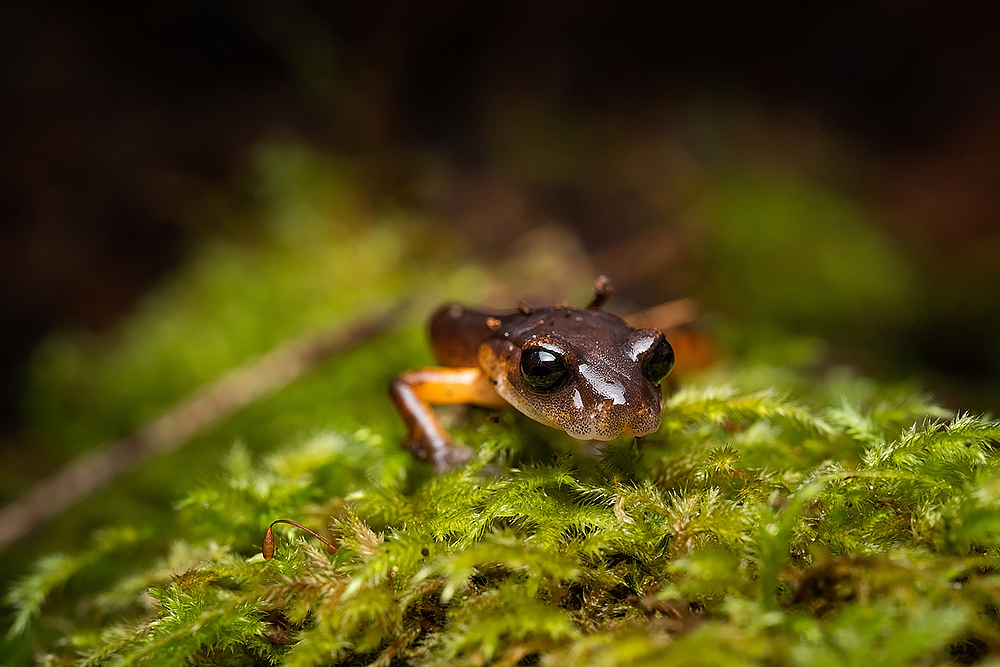

// add cover image to img directory and update filename below
ifdef::backend-html5[]

endif::backend-html5[]

== Colophon

=== Suggested citation

Bloom DA, Zermoglio P & Guralnick R (2021) Analysis of biodiversity data needs in the post-2020 framework. Copenhagen: GBIF Secretariat. https://doi.org/10.35035/doc-2ph8-0403

=== Authors

Un Author, Due Autore & https://www.orcid.org/#[Troisième Auteur]

=== Contributors

James Joyce and Samuel Beckett of Trinity College, Dublin, contributed to this version of the document.

=== Licence

The document _Analysis of biodiversity data needs in the post-2020 framework_ is licensed under https://creativecommons.org/licenses/by-sa/4.0[Creative Commons Attribution-ShareAlike 4.0 Unported License].

=== Persistent URI

https://doi.org/10.35035/doc-2ph8-0403

=== Document control

First edition, September 2021

=== Cover image

// Caption. Credit, source, licence.
Ensatina (_Ensatina eschscholtzii_), Sonoma County, California, United States. Photo 2021 Elliott Smeds via https://www.gbif.org/occurrence/3031797751[iNaturalist research-grade observations], licensed under http://creativecommons.org/licenses/by-nc/4.0/[CC BY-NC 4.0].
